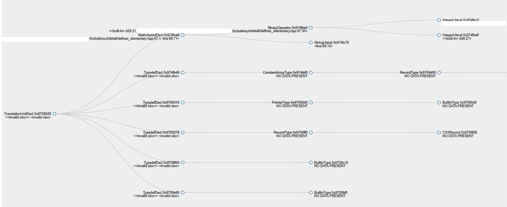

# ASTViz
---

This are a set of tools that help in visualization of AST's generated by Clang frontend of the LLVM compiler. It showcases the AST in form of graphs on a browser.
                                                   
## Table of Contents

+ [Sample Looks](https://github.com/CDAC-SSDG/Tools/blob/main/ASTViz/README.md#sample-looks) 
+ [How it works](https://github.com/CDAC-SSDG/Tools/blob/main/ASTViz/README.md#how-it-works)
+ [Usage](https://github.com/CDAC-SSDG/Tools/blob/main/ASTViz/README.md#usage)
  * [Step 1: Creating a JSON file](https://github.com/CDAC-SSDG/Tools/blob/main/ASTViz/README.md#step-2-verifying-the-json-file-generated)
  * [Step 2: Verifying the JSON file generated](https://github.com/CDAC-SSDG/Tools/blob/main/ASTViz/README.md#step-1-verifying-the-json-file-generated)
  * [Step 3: Splitting the JSON file](https://github.com/CDAC-SSDG/Tools/blob/main/ASTViz/README.md#step-3-splitting-the-json-file)
  * [Step 4: Configuring the server](https://github.com/CDAC-SSDG/Tools/blob/main/ASTViz/README.md#step-4-configuring-the-server)
  * [Step 5: Visualizing the AST](https://github.com/CDAC-SSDG/Tools/blob/main/ASTViz/README.md#step-5-visualizing-the-ast)
+ [Help](https://github.com/CDAC-SSDG/Tools/blob/main/ASTViz/README.md#help)
+ [Download Link](https://github.com/CDAC-SSDG/Tools/blobl/main/ASTViz/README.md#download-link)

## Sample Looks

Sample 1:


---

Sample 2:


## How it works

ASTViz contains a set of tools to convert Clang based AST to parsable JSON data and then makes visualization possible with GO-lang based server.

## Usage

### Step 1: Creating a JSON file

`json_creator_test1.py` a tool which takes in Clang AST and creates a JSON data file. It requires an input file that contains Clang AST without any colored text and path to output json file. This can be achieved using

```bash
clang -Xclang -ast-dump -fno-diagnostics-color program1.cpp > <path_to_ast_file>
python3 json_creator.py <path_to_ast_file> <path_to_output_json_file>
```

> [!NOTE]
> Depending on the size of AST this might take a while.

Once step -1 is complete verify the file using `json_verifier.py`.**

### Step 2: Verifying the JSON file generated

The JSON file produced by `json_creator.py` can be verified by executing following command

```bash
python3 json_verifier.py <path_to_ast_file> <path_to_generated_json_file>
```
### Step 3: Splitting the JSON file

> [!IMPORTANT]
> If the JSON file contains less than 1800 nodes this step can be skipped.

`json_splitter_mathematical_way.py` is a tool for splitting the generated JSON into smaller chunks of JSON data. It breaks the JSON data with every new JSON containing a maximum of n nodes. This can be achieved using:

```bash
python3 json_splitter_mathematical_way.py <path_to_input_json_file> <path_to_output_directory> <max_number_of_nodes_allowed> <min_number_of_nodes>
```

This will create multiple JSON split files which are stored in `<path_to_output_directory>`.

> [!TIP]
> + *This tool requires a max and min number of nodes that the new JSON can have. It is advisable to keep the min=max/2.*
> + *Since this new split JSON will be parsed by the server and visualized by the browser, it is advisable to not go beyond max=1800 as going beyond 1800 nodes will make use of more memory by the browser and parsing by server will be slow.*

> [!NOTE]
> + **Just because min is set to an arbitary number x, does not mean the tool will not generate a JSON file having nodes less than x. Though the max number of nodes in a JSON are fixed and wouldn't cross that number.**
> + **This has been tested on maximum of 1,900,000+ nodes**

### Step 4: Configuring the server

The JSON files generated in step 3 needs to be copied to path `/var/www/html/visualiser/testing/json_split_output/` inside the `ast_viz_server.sif` container. After that the server can be started using

```bash
singularity run ast_viz_server.sif
```
### Step 5: Visualizing the AST 
Finally the visualization of AST can be viewed using one's browser and visiting `http://<IP_address_of_machine_with_container_running>:6001`


## Help

In case of any help is required regarding the usage of ASTViz one can raise a issue/disscussion on this repository.

## Download Links

The files can be downloaded using [this link](https://ssdg.cdacb.in:5000/)
